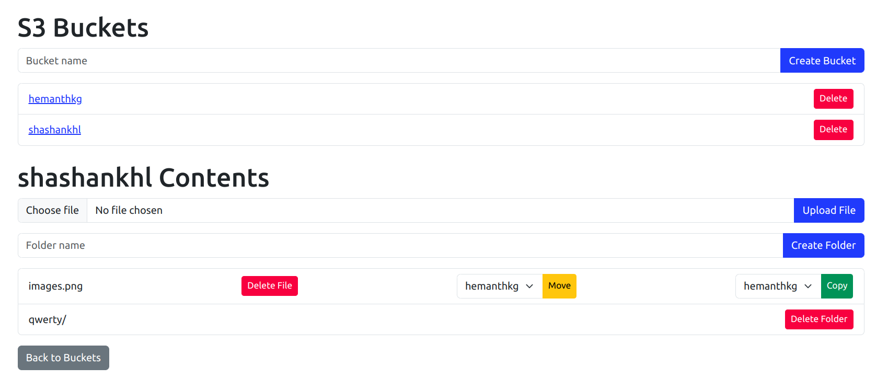
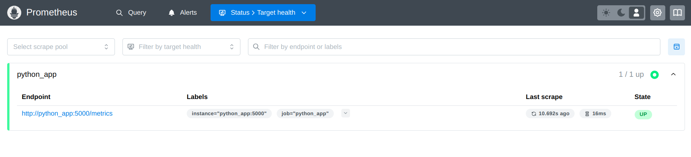
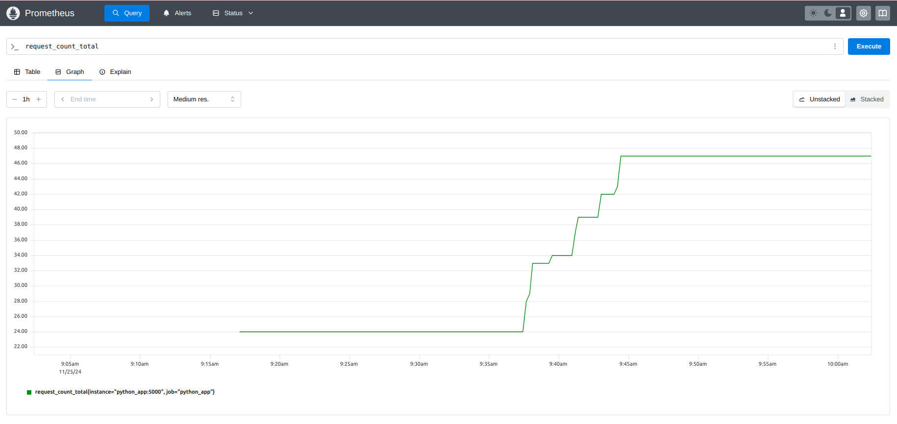
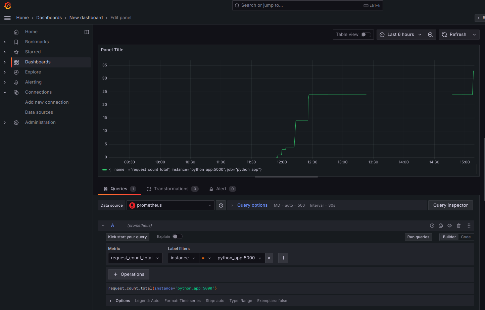

# Prometheus Assignment

-Export the metrics (like request per second, memory usage, cpu usage etc) in the existing mini project given to Interns

-Install Prometheus and Grafana using Docker (with docker-compose)

-Configure prometheus (scrape configs) such way that it can scrape the metrics from default metric path of the application job

-Validate the entire configuration to check if the data is coming or not in Prometheus UI

-Create the Dashboards in Grafana on top of the metrics exported by adding the Prometheus as a Datasource.

## How to run it

Pre-requisites

```bash
- docker
- docker-compose
```

To run this stack, run the following command

```bash
docker-compose up --build
```

## Screenshots








